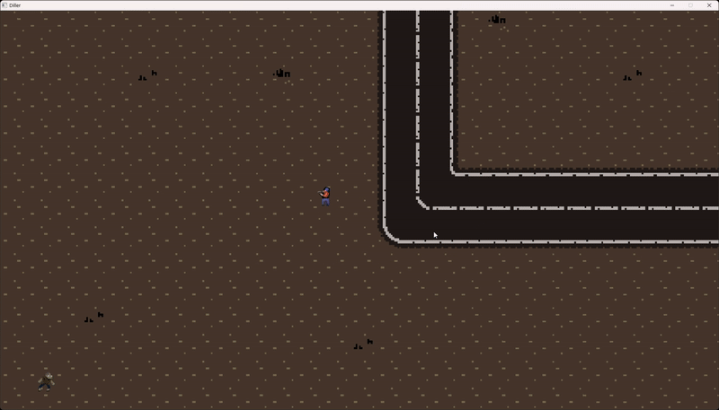

# **Shooter Game - README**  


**Shooter** è un gioco sparatutto in 2D sviluppato in **C++** utilizzando la libreria **Raylib**.  
Il giocatore controlla un personaggio che deve sopravvivere agli zombie che appaiono sullo schermo, sparando proiettili e schivando i nemici.  

---

## **🎮 Funzionalità**  
✔ **Movimento del giocatore** (WASD) con animazioni direzionali.  
✔ **Sparare proiettili** (Barra spaziatrice).  
✔ **Nemici (zombie)** che inseguono il giocatore.  
✔ **Sistema di vita degli zombie** (6 colpi per ucciderli).  
✔ **Game over** se uno zombie ti raggiunge.  
✔ **Rigiocabilità** (Premere **R** per ricominciare).  

---

## **🛠 Requisiti e Installazione**  

### **Librerie Necessarie**  
- **[Raylib](https://www.raylib.com/)** (per la grafica e l'input)  
- **Compilatore C++** (g++, Clang, MSVC)  

### **Come Compilare ed Eseguire**  
1. **Installa Raylib**  
   - Windows: [Scarica la versione precompilata](https://github.com/raysan5/raylib/releases)  
   - Linux:  
     ```sh
     sudo apt install libraylib-dev
     ```
   - macOS:  
     ```sh
     brew install raylib
     ```

2. **Clona il Repository**  
   ```sh
   git clone https://github.com/AhmedZaafrani/Shoter.git
   cd Shoter
   ```

3. **Compila il Gioco**  
   ```sh
   g++ main.cpp -o shooter -lraylib -lGL -lm -lpthread -ldl -lrt -lX11
   ```

4. **Avvia il Gioco**  
   ```sh
   ./shooter
   ```

---

## **🎨 Asset del Gioco**  
Gli sprite utilizzati sono nella cartella `Assets/`:  
- **Player** (8 direzioni)  
- **Zombie**  
- **Proiettile**  
- **Sfondo**  
- **Schermata "Wasted"**  

*(Assicurati che i percorsi dei file nel codice corrispondano alla tua struttura di cartelle!)*  

---

## **🕹️ Controlli**  
| Tasto       | Azione                     |
|-------------|----------------------------|
| **WASD**    | Muovi il personaggio       |
| **SPAZIO**  | Sparare                    |
| **SHIFT**   | Correre (aumenta velocità) |
| **R**       | Ricominciare dopo la morte |

---

## **📌 Possibili Miglioramenti**  
🔹 **Aggiungere un punteggio** (punti per ogni zombie ucciso).  
🔹 **Livelli con difficoltà crescente**.  
🔹 **Power-up** (es. armi migliori, vite extra).  
🔹 **Menu iniziale** con opzioni.  
🔹 **Supporto per controller**.  

---

## **🤝 Contribuire**  
Se vuoi contribuire al progetto:  
1. Forka il repository.  
2. Crea un nuovo branch (`git checkout -b feature/nuova-funzionalità`).  
3. Fai commit delle modifiche (`git commit -m "Aggiungi feature"`).  
4. Pusha sul branch (`git push origin feature/nuova-funzionalità`).  
5. Apri una **Pull Request**.  

---

## **📜 Licenza**  
Questo progetto è sotto licenza **MIT**.  

---

**Divertiti a giocare!** 🎮💥  

Se hai domande o problemi, apri una *Issue* su GitHub. 😊
